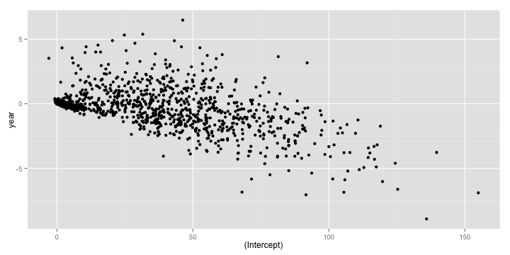

# Split-Apply-Combine: II


Recall that the core idea behind the `split-apply-combine` strategy is to

- split up the original data (this can be any format includng data.frames, lists, arrays, matrics, vectors),
- apply existing or custom functions to it, and
- combine the results in the same or different format.

In this lesson, we will explore three R packages that make it easy to apply this strategy using a simple, unified interface

## plyr

The first package we will take a look at is the `plyr` package by Hadley Wickham. The basic philosophy of `plyr` is that to carry out any `split-apply-combine` operation, a user only needs to specify the following details


1. The data structure of the input.
2. The dataset being worked on
3. The variable to split the dataset on.
4. The function to applyto each split piece.
5. The data structure of the output to combine pieces.

Accordingly, `plyr` synthesizes the entire `*apply` family into one consistent matrix of functions, a really useful toolkit!

</img>

<style>
p{text-align: justify;}
</style>

Let us revisit our earlier problem of figuring out the most popular `name` by `sex` between the years 2000 and 2008. We are passing a data frame in and want to get a data frame out. So we pick the `ddply` function, where the first `d` stands for data frame input, and the second `d` stands for data frame output.

The rest of the arguments look eerily similar to what we used in the `aggregate` function call, as should be, since these are the primitives in terms of which we can specify this data analysis problem.


```r
library(plyr)
result <- ddply(
  .data = subset(bnames2_b, year >= 2000),
  .variables = c('sex', 'name'),
  .fun = function(p){
    summarize(p, tot = sum(tot))
  }
)
```


The `plyr` package offers a lot of syntactic sugar that allows one to write really concise code. For example, the previous piece of code can be rewritten as


```r
resultB <- ddply(subset(bnames2_b, year >= 2000),
  .(sex, name), summarize, tot = sum(tot)
)
```


It works by passing the argument `tot = sum(tot)` to the `summarize` function, thereby allowing one to skip defining a separate anonymous function.


In addition to syntactic sugar, the `plyr` package provides some nice bells and whistles to run your analysis in `parallel` (you will need to have the `foreach` package installed) and also display a `progress bar`. Type `?ddply` to explore more options from the documentation.

Let us consider another interesting problem, this time from the `baseball` dataset. Suppose, we want to run a linear regression of `rbi` (runs batted in) across a player's carrer in terms of `years`.


```r
head(baseball[,1:16])
```

```
##            id year stint team lg  g  ab  r  h X2b X3b hr rbi sb cs bb
## 4   ansonca01 1871     1  RC1    25 120 29 39  11   3  0  16  6  2  2
## 44  forceda01 1871     1  WS3    32 162 45 45   9   4  0  29  8  0  4
## 68  mathebo01 1871     1  FW1    19  89 15 24   3   1  0  10  2  1  2
## 99  startjo01 1871     1  NY2    33 161 35 58   5   1  1  34  4  2  3
## 102 suttoez01 1871     1  CL1    29 128 35 45   3   7  3  23  3  1  1
## 106 whitede01 1871     1  CL1    29 146 40 47   6   5  1  21  2  2  4
```


Let us start by writing a simple function that would take a data frame consisting of a subset for a specific player and then return the regression model.


```r
rbi_vs_year <- function(df){
  df <- mutate(df, year = year - min(year))
  lm(rbi ~ year, data = df)
}
```


Note that since the model objects are not data frames, it is appropriate to return a `list` as output. So, we use the `dlply` function.


```r
models <- dlply(baseball, .(id), rbi_vs_year)
models[[1]]
```

```
##
## Call:
## lm(formula = rbi ~ year, data = df)
##
## Coefficients:
## (Intercept)         year
##      118.92        -1.73
```


We can extract the regression coefficients for each model object, using the `coef` function. So


```r
coef(models[[1]])
```

```
## (Intercept)        year
##     118.924      -1.732
```


What if we wanted a `data.frame` of coefficients? Once again the key is to note that we start with a __l__ist of model objects and want an __d__ataframe as output.


```r
coefs <- ldply(models, coef)
qplot(`(Intercept)`, year, data = coefs)
```




The `plyr` package is very feature rich and I would encourage you to explore more of it. The one flip side to using `plyr` is that it can be very slow on large data sets. In such situations, you have the option of using two other R packages `dplyr`, the anointed successor of `plyr` and  `data.table`.

## dplyr

The `dplyr` package is a next generation implementation of `plyr`. According to the author Hadley Wickham,

> dplyr is a new package which provides a set of tools for efficiently manipulating datasets in R. dplyr is the next iteration of plyr, focussing on only data frames. dplyr is faster, has a more consistent API.

Some of the nice features of `dplyr` are:

1. Speed: All underlying manipulations are carried out in C++ using `Rcpp`.
2. Consistentcy: All tabular data is treated similarly allowing one to work with `data frames` and `databases` in very much the same way.
3. Simplicity

Let us take an example involving the `Batting` dataset from the `Lahman` package. We are interested in computing the total number of games played by a player, arranged in decreasing order of totals.

In `plyr`, we would write the following code


```r
games <- ddply(Batting, .(playerID), summarize, total = sum(G))
head(arrange(games, desc(total)), 5)
```

```
##    playerID total
## 1  rosepe01  3562
## 2 yastrca01  3308
## 3 aaronha01  3298
## 4 henderi01  3081
## 5  cobbty01  3035
```


The same piece of code can be rewritten in `dplyr`, using its version of the chain operator, `%.%`:


```r
library(dplyr)
games_d <- Batting %.%
  group_by(playerID) %.%
  summarize(total = sum(G)) %.%
  arrange(desc(total)) %.%
  head(5)
```


This should be a natural way of writing code for those of you familiar with `pandas`.

If you ran both pieces of code, you will notice that `dplyr` is significantly faster than `plyr`.

## data.table


```r
library(data.table)
Batting_DT <- data.table(Batting)
games_dt <- Batting_DT[,
  list(total = sum(G)),
  "playerID"
][
  head(order(-total), 5),
]
```


