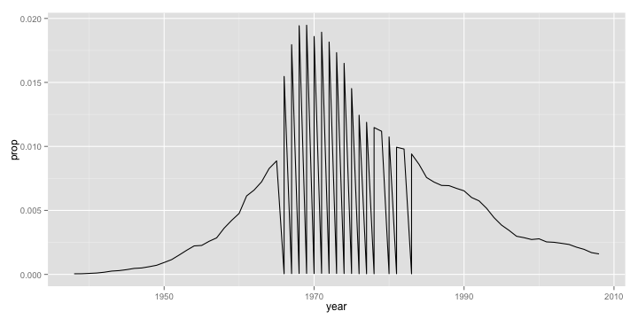
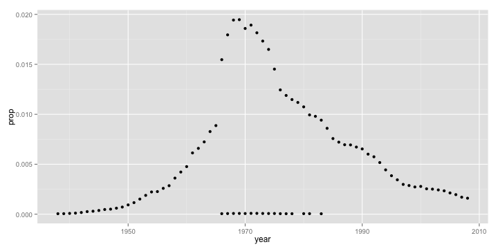

# Summarize


### Baby Names

The first dataset we will be exploring is the [bnames2](data/bnames2.csv.bz2) dataset, which consists of the top 1000 male and female baby names in the US, from 1880 to 2008. It consists of 258,000 records (1000 x 2 x 129) with five ariables: `year`, `name`, `soundex`, `sex` and `prop`.

Let us begin by reading the dataset into our R session. Note that `read.csv` can work directly on the zipped file, so there is no reason to unzip it prior to reading.


```r
bnames2 <- read.csv("data/bnames2.csv.bz2")
```


<!-- html table generated in R 3.0.3 by xtable 1.7-3 package -->
<!-- Tue Apr 15 05:00:37 2014 -->
<TABLE >
<TR> <TH> year </TH> <TH> name </TH> <TH> prop </TH> <TH> sex </TH> <TH> soundex </TH>  </TR>
  <TR> <TD align="right"> 1880 </TD> <TD> John </TD> <TD align="right"> 0.08 </TD> <TD> boy </TD> <TD> J500 </TD> </TR>
  <TR> <TD align="right"> 1880 </TD> <TD> William </TD> <TD align="right"> 0.08 </TD> <TD> boy </TD> <TD> W450 </TD> </TR>
  <TR> <TD align="right"> 1880 </TD> <TD> James </TD> <TD align="right"> 0.05 </TD> <TD> boy </TD> <TD> J520 </TD> </TR>
  <TR> <TD align="right"> 1880 </TD> <TD> Charles </TD> <TD align="right"> 0.05 </TD> <TD> boy </TD> <TD> C642 </TD> </TR>
  <TR> <TD align="right"> 1880 </TD> <TD> George </TD> <TD align="right"> 0.04 </TD> <TD> boy </TD> <TD> G620 </TD> </TR>
  <TR> <TD align="right"> 1880 </TD> <TD> Frank </TD> <TD align="right"> 0.03 </TD> <TD> boy </TD> <TD> F652 </TD> </TR>
   </TABLE>


There are several interesting questions one might ask with this sort of data. Let us start with a simple question of tracking the popularity of a specific name over time. It is usual for people to try and track their own name. However, given that my name is nowhere to be found in this dataset, I am going to use `Greg`, since I knew beforehand that he was going to be in the audience (Sorry Greg!)


```r
greg <- subset(bnames2, name == "Greg")
```


It is easier to explore data visually. So let us plot the trend using `ggplot2`. This is going to be a light-weight introduction to this wonderful package, of which we are going to see more in later sessions. 

The code below is self-explanatory. We are using the `qplot` function (which stands for __q__uickplot), and asking it to draw us a `line` plot of `year` vs. `prop`, both of which are to be looked up in the dataset `greg`.


```r
library(ggplot2)
qplot(x = year, y = prop, data = greg, geom = 'line')
```


We see (quite unexpectedly I think!) that Greg as a name peaked in popularity sometime in 1965 and has since been on the decline.

Let us take another name at random, say "Michelle"


```r
michelle <- subset(bnames2, name == "Michelle")
qplot(x = year, y = prop, data = michelle, geom = 'line')
```




Mmm.. this looks like a big mess. Why do we see this awful sawtooth like pattern? Can you come up with a reason?

Let us plot the same data using `point` instead of `line`.


```r
qplot(x = year, y = prop, data = michelle, geom = 'point')
```




It seems like there are two clusters of data. Well, it is not surprising since Michelle is a name used for both boys and girls. So, if we were to create a `line` plot, we should make sure to tell `qplot` to group the variables by `sex`. 


```r
qplot(x = year, y = prop, data = michelle, geom = 'line', group = sex)
```


Note that we could also tell `qplot` to color the lines based on `sex` by passing `color = sex` in the call. We don't have to set the `group` argument, since `qplot` will automatically do it for us. Magical right!

__Exercise 1__

Repeat the same exercises we did for `name` with the variable `soundex`. In other words, use the `soundex` variable to extract all names that sound like yours and plot their popularity. Make sure to think about the `geom` you would like to use!

__Solution 1__


```r
greg_soundex = greg$soundex[1]
greg_like <- subset(bnames2, soundex == greg_soundex)
qplot(x = year, y = prop, data = greg_like, geom = 'point')
```


If we had to track the popularity of a specific `soundex`, we need to `summarize` the data by aggregating the values of `prop` across all names with the same soundex. Once again, while base R has all the tooling to accomplish this directly, I am a big fan of doing this with the `plyr` package, which provides a remarkably consistent set of verbs to manipulate data.

### Data Manipulation Verbs

It is good to think of data manipulation in terms of verbs. Those of you who have used `SQL` or `pandas` might be familiar with these already. Here are some basic verbs that we will be exploring


1. subset
1. mutate
2. arrange
3. summarize
5. join

Another important verb that is often used in conjunction with the above five is `group`. Rather than explaining the theory behind each of these verbs and their usage, let us get our hands dirty with interesting questions posed by data and using it to discover these verbs! I will make sure to give you a concise summary at the end of this session.

__Exercise 2__

Explore the following

- In which year was your name most popular? Least popular?
- Reorder the data frame containing your name from highest to lowest popularity.
- Add a new column that gives the number of babies per thousand with your name.


## Births

Suppose, we want to explore trends in the total number of people with a specific name across all the years. The [bnames2](data/bnames2) dataset only has proportions. So, to be able to address this question, we need total number of births by year.

Fortunately, that data is available too. Let us read in the [births](data/births.csv) dataset and plot the trends in total number of `births` across `sex` by `year`.


```r
births <- read.csv("data/births.csv")
qplot(year, births, data = births, color = sex, geom = 'line')
```


__What explains the peaks?__

<a href="javascript:expandcollapse('solution1')">
   [+/-] Answer
</a><br>

<span class='posthidden' id='solution1'>
- 1936: SSNs were issued for the first time.
- 1986: needed for child tax deduction.
</span>

### Join

Going back to the question we were trying to address, we need a way to `join` the `births` data with `bnames2` so that we can compute total numbers. Base R has the `merge` function to achieve this. But, I am partial to the `join` function in `plyr`, and so we shall use that.


```r
bnames2_b <- join(bnames2, births, by = c("sex", "year"))
```


<!-- html table generated in R 3.0.3 by xtable 1.7-3 package -->
<!-- Tue Apr 15 05:00:41 2014 -->
<TABLE >
<TR> <TH> year </TH> <TH> name </TH> <TH> prop </TH> <TH> sex </TH> <TH> soundex </TH> <TH> births </TH>  </TR>
  <TR> <TD align="right"> 1880 </TD> <TD> John </TD> <TD align="right"> 0.08 </TD> <TD> boy </TD> <TD> J500 </TD> <TD align="right"> 118405 </TD> </TR>
  <TR> <TD align="right"> 1880 </TD> <TD> William </TD> <TD align="right"> 0.08 </TD> <TD> boy </TD> <TD> W450 </TD> <TD align="right"> 118405 </TD> </TR>
  <TR> <TD align="right"> 1880 </TD> <TD> James </TD> <TD align="right"> 0.05 </TD> <TD> boy </TD> <TD> J520 </TD> <TD align="right"> 118405 </TD> </TR>
  <TR> <TD align="right"> 1880 </TD> <TD> Charles </TD> <TD align="right"> 0.05 </TD> <TD> boy </TD> <TD> C642 </TD> <TD align="right"> 118405 </TD> </TR>
  <TR> <TD align="right"> 1880 </TD> <TD> George </TD> <TD align="right"> 0.04 </TD> <TD> boy </TD> <TD> G620 </TD> <TD align="right"> 118405 </TD> </TR>
  <TR> <TD align="right"> 1880 </TD> <TD> Frank </TD> <TD align="right"> 0.03 </TD> <TD> boy </TD> <TD> F652 </TD> <TD align="right"> 118405 </TD> </TR>
   </TABLE>


There are several ways to `join` data, especially around the handling of rows/columns that are not present in one of the two datasets being merged. Here is a set of simple venn-diagrams to illustrate the possibilities. The `join` function supports most of these using the `type` and `match` argument. You can read up the documentation using `?join` for more details.


Now that we have all the data required to carry out the exploration exercise we started, let us power through. 


```r
greg <- subset(bnames2_b, name == 'Greg')
greg <- mutate(greg, tot = prop * births)
qplot(year, births, data = greg, geom = 'line')
```


Ah. This looks better. So Greg's name is picking up popularity in absolute terms!

__Exercise 3__

What is the most popular name in the US across all these years (1880 - 2008)? Any guesses? Enter your guesses on Etherpad.

__Solution 3__

We can answer this question if we can compute the total number of people with a specific name summed up across all the years. For a specific name, we can use the `summarize` function to compute this summary.


```r
greg_tot <- summarize(greg, tot = sum(prop * births))
```


How do we do this for all names. In terms of pseudocode, here is what we would do.

1. __Split__ the dataset by name.
2. __Apply__ the summary computations to each name.
3. __Combine__ the summaries created into a single dataset.

Let us implement this in code.


```r
# Split
pieces <- split(bnames2_b, bnames2_b$name)

# Apply
results <- vector("list", length(pieces))
for (i in seq_along(pieces)){
  results[[i]] <- summarize(pieces[[i]],
     name = name[1],
     tot = sum(prop * births)
  )
}

# Combine
result <- do.call("rbind", results)
```


To answer the question, we need to `arrange` the data in descending order of the variable `tot`.


```r
most_pop_name <- arrange(result, desc(tot))[1,"name"]
```


Ready to see the final answer!

<a href="javascript:expandcollapse('solution2')">
   [+/-] Answer
</a><br>

<span class='posthidden' id='solution2'>
And the winner is ... __James__
</span>


__Exercise 4__

Suppose you want to find the most popular `soundex` across all the years. Look through the code we used earlier in Exercise 3 and reason out what lines need to change. Run the code if you have the time.

The __split-apply-combine__ pattern we used here is a very commonly observed pattern in several data analysis problems. If you attempted Exercise 4, you would have observed that there is a lot of boilerplate code in that analysis. In essence, there are only three elements that the user needs to specify.

1. The dataset to work on.
2. The variable(s) to split the dataset by.
3. The function to apply to each of the pieces.

In the next lesson, we will explore how we can use some nifty R functions to accomplish this in a cleaner way with much lesser code.
