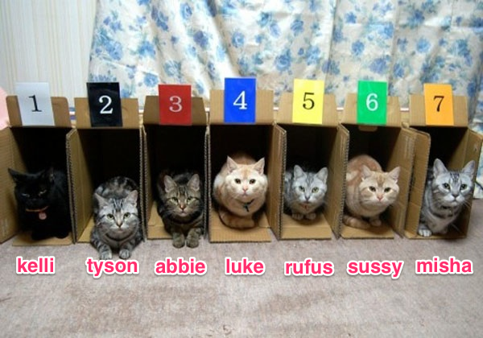

# Data Structures


In this lesson you will learn about the basic data structures in R and how you can create, modify, access and combine them.

A very useful mantra while approaching the R language is concisely summarized in this quote by John Chambers

> To understand computations in R, two slogans are helpful: <br/>
> 1. Everything that exists is an object. <br/>
> 2. Everything that happens is a function call.

## Vectors

Every object in R is effectively a `vector`. The simplest way to think about a vector is to picture it as a container of boxes. Each box holds an object. The boxes are ordered sequentially, and can optionally have names.

</img>

There are two types of vectors in R:

1.  (Atomic) Vector
2.  List

An (atomic) vector, as the name suggests, consists of objects that are indivisible and of the same `type`. There are six atomic types in R: `logical`, `integer`, `double`, `complex`, `character` and `raw`. So a vector could consist of objects that belong to any one of these six types.

__Create__

The simplest way to construct a vector is to use the `c` function to _combine_ a set of objects.


```r
# vector of the `numeric` type
x <- c(1, 2, 3, 4, 5)
```

You can use the `typeof` function to determine the `type` of object a vector contains


```r
typeof(x)
## [1] "double"
```


You can also use `vector` to initialize a vector of a given `type` and `length` and then fill it up with objects.


```r
x <- vector("character", 2)
x[1] <- "A"
x[2] <- "B"
```


For those of you coming from a more traditional programming language like `python` or `ruby`, it will be surprising to note that R does not have the concept of a `scalar`. So, an assignment like `x <- 1` is still creating a vector, but of length one.

__Access__

While analysing data, we often need to access pieces of data stored inside a data structure. In this section we will learn how to access the objects stored in a vector. To keep things interesting, let me create a vector of cats


```r
x <- c(kelli = "girl", tyson = "boy", abbie = "girl", luke = "boy",
	rufus = "boy", sussy = "girl", misha = "girl"
)

```


Now suppose I want to call out all the girls. There are a number of ways I could do it.

__Position__

First, I could use the __position__ of the boxes to identify the cats I want to call out,


```r
x[c(1, 3, 6, 7)]
##  kelli  abbie  sussy  misha
## "girl" "girl" "girl" "girl"
```


or the cats I DON'T want to call out.


```r
x[-c(2, 4, 5)]
##  kelli  abbie  sussy  misha
## "girl" "girl" "girl" "girl"
```

The minus sign in this case drops the cats in boxes 2, 4 and 5, leaving only the ones we want to call out.

> This might seem confusing to those of you coming from Python, where x[-2] refers to the 2nd element from the end, whereas in R, it refers to all but the 2nd element.

__Name__

Second, I could use the __names__ of the cats I want to call out.


```r
x[c("kelli", "abbie", "sussy", "misha")]
##  kelli  abbie  sussy  misha
## "girl" "girl" "girl" "girl"
```

__Logical__

Yet another way to do this is to create a yes/no sequence to indicate which cats I want to call out (T stands for TRUE and F for FALSE in R)


```r
x[c(T, F, T, F, F, T, T)]
##  kelli  abbie  sussy  misha
## "girl" "girl" "girl" "girl"
```

We can use this approach to simplify our code to access all girl cats, and write


```r
x[x == "girl"]
##  kelli  abbie  sussy  misha
## "girl" "girl" "girl" "girl"
```


Sticking with the __named-cats-in-numbered boxes__ example,


